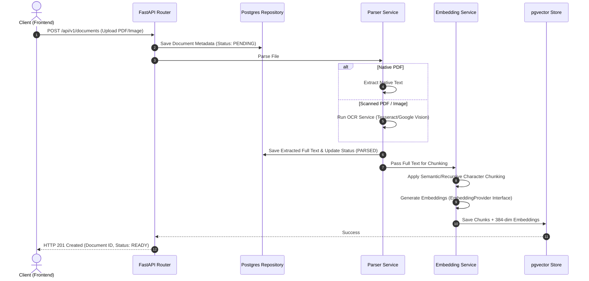
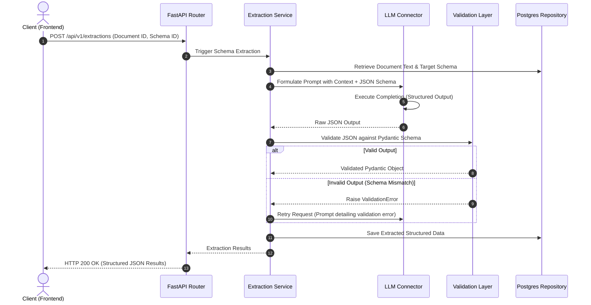

# 🏗️ System Architecture - DocuFlow AI

This document details the architectural layout, core design decisions, and system blueprints for **DocuFlow AI**.

---

## 1. Architectural Philosophy

DocuFlow AI strictly adheres to **Clean Architecture** and **SOLID Principles**. The codebase is designed to decouple business rules from infrastructure details (like database models, external APIs, and OCR engines).

### The Clean Architecture Layer Model

Our application is divided into concentric layers where dependencies only point inward:

```
+-----------------------------------------------------------+
|                   INFRASTRUCTURE LAYER                    |
|  [Next.js Frontend] [Docker] [PostgreSQL / pgvector]      |
+-----------------------------------------------------------+
                             |
                             v
+-----------------------------------------------------------+
|                       API LAYER                           |
|       [FastAPI Routers] [Middlewares] [Dependencies]      |
+-----------------------------------------------------------+
                             |
                             v
+-----------------------------------------------------------+
|                    APPLICATION LAYER                      |
|      [Services (Extraction, Parsing, Vector Ingestion)]    |
+-----------------------------------------------------------+
                             |
                             v
+-----------------------------------------------------------+
|                     DATA ACCESS LAYER                     |
|           [Repositories] [SQLAlchemy DB Models]           |
+-----------------------------------------------------------+
                             |
                             v
+-----------------------------------------------------------+
|                      DOMAIN LAYER                         |
|             [Pydantic Schemas / DTOs] [Enums]             |
+-----------------------------------------------------------+
```

1. **Domain Layer (`schemas/`, `constants/`)**: Holds plain models (Pydantic schemas) and enterprise rules. Free from external library imports (except Pydantic).
2. **Data Access Layer (`repositories/`, `models/`)**: Deals with raw data storage, querying, and updating. Translates DB models into domain schemas.
3. **Application Layer (`services/`)**: Orchestrates data flows and processes logic (e.g., parsing PDFs, generating embeddings, executing extraction workflows).
4. **API Layer (`api/`)**: Defines HTTP routes, input validation, serialization, authentication dependencies, and error handling.
5. **Infrastructure Layer**: Outer systems like Next.js, PostgreSQL/pgvector database, Hugging Face transformers, and LLM services.

---

## 2. Core Pipelines & Component Flows

### A. Document Ingestion & Processing Pipeline

This pipeline handles file uploading, persistent storage, text extraction (native and OCR), chunking, embedding generation, and indexing.



### B. AI Extraction Pipeline

Converts parsed documents into structured JSON objects adhering to user-defined extraction schemas.



---

## 3. SOLID & Clean Coding Patterns

To prevent the application from degrading into spaghetti code over time, we enforce the following guidelines:

### Single Responsibility Principle (SRP)
- **Routers** are thin. Their only job is to receive requests, run dependency injection, call a service, and return results.
- **Services** contain business logic. They do not query the database directly; instead, they call a Repository.
- **Repositories** handle database queries. They do not know about LLMs, schemas parsing, or file saving.

### Open/Closed Principle (OCP)
- **Parsers** inherit from a base class `BaseParser`. If we switch from PyMuPDF to an OCR engine, we subclass it without editing the service.
- **LLM Clients** inherit from `BaseLLMClient`. This allows swapping between Anthropic, OpenAI, or local Ollama with zero business logic modifications.

### Liskov Substitution Principle (LSP)
- All parser implementations must strictly adhere to the `BaseParser` interface:
  ```python
  class BaseParser(ABC):
      @abstractmethod
      async def parse(self, file_content: bytes) -> ParsedDocumentDTO:
          pass
  ```

### Dependency Inversion Principle (DIP)
- Inject dependencies using FastAPI's `Depends` system.
- Never instantiate database sessions, repositories, or services globally.
- E.g., a router depends on a service interface, which in turn depends on a repository interface.

---

## 4. Embedding Provider Pattern

To ensure we can scale from local, lightweight testing environments to massive production clouds, the vector generation step is abstracted under the **Provider Pattern**.

```
                           +-------------------+
                           | Ingestion Pipeline|
                           +---------+---------+
                                     |
                         queries/    | (injects interface)
                         chunks      v
                           +-------------------+
                           | EmbeddingProvider |
                           |    (Abstract)     |
                           +----+---------+----+
                                |         |
                     +----------+         +----------+
                     |                               |
                     v                               v
           +-------------------+           +-------------------+
           | FastEmbedProvider |           | OpenAIProvider    |
           |   (Local CPU)     |           | (Cloud API / 384) |
           +-------------------+           +-------------------+
```

### Performance & Configuration Tradeoffs

1. **FastEmbed (Local, Default)**:
   - Uses BGE-small-en-v1.5 (384 dimensions).
   - Runs locally on CPU via ONNX Runtime (no PyTorch, no CUDA required).
   - Zero API costs, runs offline.
   - Synchronous CPU-bound work is offloaded to Python's `ThreadPoolExecutor` to avoid blocking the async event loop.
2. **OpenAI (Cloud)**:
   - Uses `text-embedding-3-small` model.
   - Requires API key and network connection.
   - Employs **Matryoshka Representation Learning** to truncate vectors from 1536 down to **384 dimensions** directly at the API side.
   - Matches our local database vector column sizes without requiring migrations or column redefinitions.

