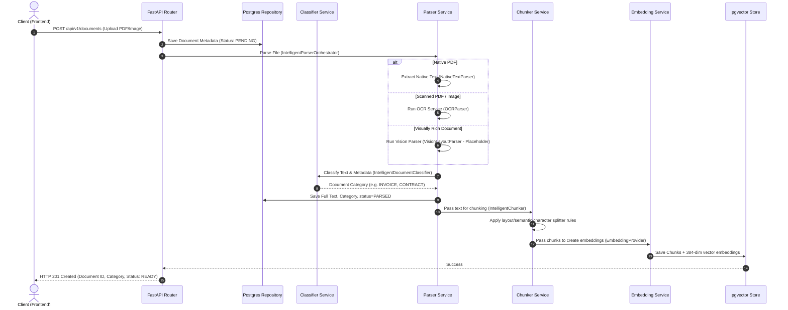
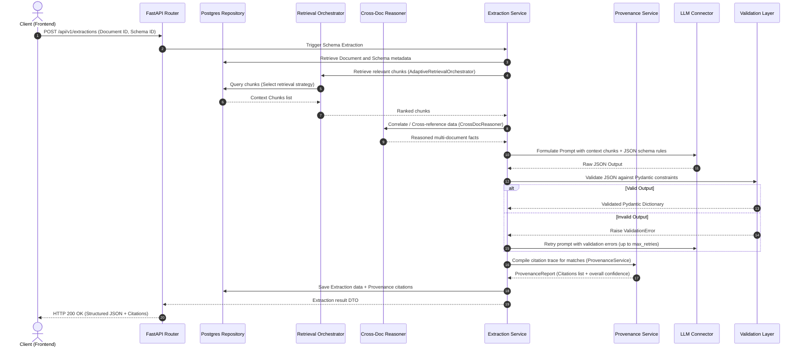

# 🏗️ System Architecture - DocuFlow AI

This document details the architectural layout, core design decisions, and system blueprints for **DocuFlow AI**.

---

## 1. Architectural Philosophy

DocuFlow AI strictly adheres to **Clean Architecture** and **SOLID Principles**. The codebase is designed to decouple business rules from infrastructure details (like database models, external APIs, and OCR engines).

### High-Level System Overview
The following diagram highlights the simple flow of the platform from client down to the database and vector storage:

```
Client
    │
    ▼
Next.js Frontend
    │
    ▼
FastAPI Backend
    │
    ├── Parsing
    ├── Retrieval
    ├── Extraction
    ├── Embedding Provider
    └── Provenance
             │
             ▼
PostgreSQL + pgvector
```

### The Clean Architecture Layer Model

Our application is divided into concentric layers where dependencies only point inward:

```
+-----------------------------------------------------------+
|                   INFRASTRUCTURE LAYER                    |
|  [Next.js Frontend] [Docker] [PostgreSQL / pgvector]      |
+-----------------------------------------------------------+
                             |
                             v
+-----------------------------------------------------------+
|                       API LAYER                           |
|       [FastAPI Routers] [Middlewares] [Dependencies]      |
+-----------------------------------------------------------+
                             |
                             v
+-----------------------------------------------------------+
|                    APPLICATION LAYER                      |
|      [Services (Extraction, Parsing, Vector Ingestion)]   |
+-----------------------------------------------------------+
                             |
                             v
+-----------------------------------------------------------+
|                     DATA ACCESS LAYER                     |
|           [Repositories] [SQLAlchemy DB Models]           |
+-----------------------------------------------------------+
                             |
                             v
+-----------------------------------------------------------+
|                      DOMAIN LAYER                         |
|             [Pydantic Schemas / DTOs] [Enums]             |
+-----------------------------------------------------------+
```

1. **Domain Layer (`schemas/`, `constants/`)**: Holds plain models (Pydantic schemas) and enterprise rules. Free from external library imports (except Pydantic).
2. **Data Access Layer (`repositories/`, `models/`)**: Deals with raw data storage, querying, and updating. Translates DB models into domain schemas.
3. **Application Layer (`services/`)**: Orchestrates data flows and processes logic (e.g., parsing PDFs, generating embeddings, executing extraction workflows).
4. **API Layer (`api/`)**: Defines HTTP routes, input validation, serialization, authentication dependencies, and error handling.
5. **Infrastructure Layer**: Outer systems like Next.js, PostgreSQL/pgvector database, Hugging Face transformers, and LLM services.

---

## 2. Core Pipelines & Component Flows

### A. Document Ingestion & Processing Pipeline

This pipeline handles file uploading, parsing, type classification, intelligent chunking, and vector indexing.



#### Document Classification & Routing
Document classification acts as the gateway deciding the downstream processing pipeline. Depending on the predicted type, the document is routed to specialized schema extractions:

```
Document Classification
        │
        ▼
Pipeline Selection
   ├── Invoice Pipeline ────> (Retrieves vendor, date, line items)
   ├── Contract Pipeline ───> (Retrieves governing laws, limits, liability)
   ├── General Pipeline ────> (Retrieves metadata summary summaries)
   └── Future Pipelines ────> (Custom schema validations)
```

---

### B. Document Intelligence Pipeline

Converts parsed documents into structured JSON objects by retrieving context, performing cross-document reasoning, and enforcing schema-based validation.



---

## 3. Core Component Designs

### Adaptive Retrieval Orchestrator
Instead of relying strictly on semantic distance vector lookups, the retrieval layer selects the strategy depending on query target intent:

```
AdaptiveRetrievalOrchestrator
            │
            ├── Semantic Search (Dense pgvector cosine comparisons)
            ├── Metadata Search (Relational filters over SQL columns)
            ├── Hybrid Search (Keyword ranking + Dense vectors)
            ├── Layout-aware Search (Future Placeholder - structural matching)
            ├── Table-aware Search (Future Placeholder - tabular grid mapping)
            └── Knowledge Graph Retrieval (Future Placeholder - entity relation walks)
```

### Cross-Document Reasoning Layer
This module handles comparisons, audits, and validations across multiple uploaded records rather than treating documents in isolation. Key workloads include:
- **Invoice vs. Contract**: Check if billed hourly rates comply with signed master agreement limits.
- **Invoice vs. Purchase Order**: Validate invoice totals match original PO balances.
- **Report vs. Meeting Notes**: Audit completed status items against planned items.

---

### Provenance Service
The `ProvenanceService` generates standardized audit metadata to ensure strict explainability. It isolates traceability logic from LLM prompt execution, constructing structured `ProvenanceReport` objects tracking:
- **document_id**: UUID referencing the parent document.
- **page_number**: Page where the information resides.
- **chunk_id**: Specific database chunk containing the source text.
- **retrieval_strategy**: Strategy selected by the orchestrator (e.g. SEMANTIC, METADATA).
- **confidence_score**: Correlation metric indicating accuracy.
- **bounding_boxes**: Coordinates showing spatial bounds (future vision integration).
- **ocr_coordinates**: Character location mappings for auditing (future vision integration).

---

## 4. SOLID & Clean Coding Patterns

To prevent the application from degrading into spaghetti code over time, we enforce the following guidelines:

### Single Responsibility Principle (SRP)
- **Routers** are thin. Their only job is to receive requests, run dependency injection, call a service, and return results.
- **Services** contain business logic. They do not query the database directly; instead, they call a Repository.
- **Repositories** handle database queries. They do not know about LLMs, schemas parsing, or file saving.
- **ProvenanceService** compiles citation metadata and confidence scores independently of LLM prompts and extraction rules.

### Open/Closed Principle (OCP)
- **Parsers** inherit from a base class `BaseParser`. If we switch from PyMuPDF to an OCR engine, we subclass it without editing the service.
- **LLM Clients** inherit from `BaseLLMClient`. This allows swapping between Anthropic, OpenAI, or local Ollama with zero business logic modifications.

### Liskov Substitution Principle (LSP)
- All parser implementations must strictly adhere to the `BaseParser` interface:
  ```python
  class BaseParser(ABC):
      @abstractmethod
      async def parse(self, file_content: bytes) -> ParsedDocumentDTO:
          pass
  ```

### Dependency Inversion Principle (DIP)
- Inject dependencies using FastAPI's `Depends` system.
- Never instantiate database sessions, repositories, or services globally.
- E.g., a router depends on a service interface, which in turn depends on a repository interface.

---

## 5. Embedding Provider Pattern

To ensure we can scale from local, lightweight testing environments to massive production clouds, the vector generation step is abstracted under the **Provider Pattern**.

```
                           +-------------------+
                           | Ingestion Pipeline|
                           +---------+---------+
                                     |
                         queries/    | (injects interface)
                         chunks      v
                           +-------------------+
                           | EmbeddingProvider |
                           |    (Abstract)     |
                           +----+---------+----+
                                |         |
                     +----------+         +----------+
                     |                               |
                     v                               v
           +-------------------+           +-------------------+
           | FastEmbedProvider |           | OpenAIProvider    |
           |   (Local CPU)     |           | (Cloud API / 384) |
           +-------------------+           +-------------------+
```

### Rationale & Configuration Tradeoffs

1. **FastEmbed (Local, Default)**:
   - Uses BGE-small-en-v1.5 (384 dimensions).
   - Runs locally on CPU via ONNX Runtime (no PyTorch, no CUDA required).
   - Zero API costs, runs offline.
   - **Engineering Rationale**: FastEmbed is the default provider because it maintains a dramatically smaller dependency footprint than PyTorch-heavy libraries, resulting in significantly lighter Docker images (saving gigabytes of cache size), faster local development cycles, and simpler container orchestration.
2. **OpenAI (Cloud)**:
   - Uses `text-embedding-3-small` model.
   - Requires API key and network connection.
   - Employs **Matryoshka Representation Learning** to truncate vectors from 1536 down to **384 dimensions** directly at the API side.
   - Matches our local database vector column sizes without requiring migrations or column redefinitions.

---

## 6. Future Pipeline Extensions

Planned modules designed as expansion hooks in the platform architecture:

- **Vision-aware Layout RAG**: Ingest layout structures (using models like Florence-2) to preserve reading order around columns, figures, and sidebars.
- **Layout Search**: Retrieve chunks based on visual position attributes (e.g. matching headers or footnotes).
- **Table-aware Retrieval**: Map tabular grids to markdown or structured cells to prevent table row fragmentation during chunk splits.
- **Knowledge Graph Retrieval**: Store entity triples (subject-predicate-object) in a graph database to walk complex relation queries.
- **Retrieval Benchmark Dashboard**: Live metrics tracking retrieval hits/misses, precision, and latency comparisons.
- **Human Feedback Loop**: Expose validation interfaces where reviewers can confirm or override structured JSON extraction runs.
- **Confidence Evaluation Engine**: Automate hallucinations detection checks using LLM-as-a-judge patterns.
- **Document Relationship Graph**: Build semantic indices showing connections (similarity links or shared schemas) across document repositories.
