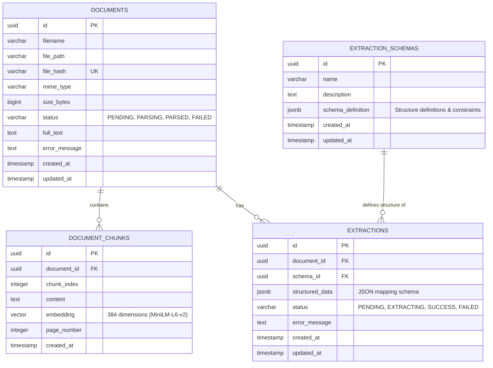

# 🗄️ Database Design - DocuFlow AI

This document outlines the database schema, entity relationships, indexes, and pgvector configuration for **DocuFlow AI**.

---

## 1. Database Technologies & Setup

- **Database Engine**: PostgreSQL 16+
- **Extension**: `pgvector` for storage and query of high-dimensional embeddings.
- **ORM**: SQLAlchemy 2.0 (declarative mapping, async session management).
- **Migrations**: Alembic for version tracking and safe schema upgrades.

---

## 2. Entity-Relationship Diagram



---

## 3. Table Definitions

### A. `documents`
Stores file metadata and extracted full-text content.

| Column Name | Type | Constraints | Description |
| :--- | :--- | :--- | :--- |
| `id` | `UUID` | Primary Key | Unique document identifier. |
| `filename` | `VARCHAR(255)` | NOT NULL | Name of the uploaded file. |
| `file_path` | `VARCHAR(512)` | NOT NULL | Path on volume/S3 storage. |
| `file_hash` | `VARCHAR(64)` | NOT NULL, UNIQUE | SHA-256 hash of file contents to prevent duplicate uploads. |
| `mime_type` | `VARCHAR(100)` | NOT NULL | E.g., `application/pdf`, `image/png`. |
| `size_bytes` | `BIGINT` | NOT NULL | File size in bytes. |
| `status` | `VARCHAR(30)` | NOT NULL | Enum: `PENDING`, `PARSING`, `PARSED`, `FAILED`. |
| `full_text` | `TEXT` | NULL | Full text extracted from the document. |
| `error_message`| `TEXT` | NULL | Processing failure descriptions. |
| `created_at` | `TIMESTAMP` | DEFAULT NOW() | Record creation date. |
| `updated_at` | `TIMESTAMP` | DEFAULT NOW() | Record modification date. |

---

### B. `document_chunks`
Stores text segments and corresponding text embeddings for vector search.

| Column Name | Type | Constraints | Description |
| :--- | :--- | :--- | :--- |
| `id` | `UUID` | Primary Key | Unique chunk identifier. |
| `document_id` | `UUID` | FK -> `documents.id`, CASCADE | Associated document. |
| `chunk_index` | `INTEGER` | NOT NULL | Sequential index of chunk. |
| `content` | `TEXT` | NOT NULL | Plain-text content of this chunk. |
| `embedding` | `VECTOR(384)` | NOT NULL | `pgvector` embeddings field (384 dimensions). |
| `page_number` | `INTEGER` | NULL | The 1-based page number where this chunk was extracted. |
| `created_at` | `TIMESTAMP` | DEFAULT NOW() | Chunk generation timestamp. |

*Note: The dimension size (384) corresponds to the Sentence-Transformers `all-MiniLM-L6-v2` model, which provides a highly optimized balance of search accuracy and processing performance.*

---

### C. `extraction_schemas`
Defines target data schemas for structured information extraction.

| Column Name | Type | Constraints | Description |
| :--- | :--- | :--- | :--- |
| `id` | `UUID` | Primary Key | Unique schema identifier. |
| `name` | `VARCHAR(100)` | NOT NULL | E.g., "Invoice Schema", "Resume Schema". |
| `description` | `TEXT` | NULL | Description of the extraction targets. |
| `schema_definition`| `JSONB` | NOT NULL | Structured representation of properties, types, and constraints. |
| `created_at` | `TIMESTAMP` | DEFAULT NOW() | Schema creation date. |
| `updated_at` | `TIMESTAMP` | DEFAULT NOW() | Schema modification date. |

---

### D. `extractions`
Stores structured extraction results outputted by LLMs.

| Column Name | Type | Constraints | Description |
| :--- | :--- | :--- | :--- |
| `id` | `UUID` | Primary Key | Unique extraction execution identifier. |
| `document_id` | `UUID` | FK -> `documents.id`, CASCADE | Associated document. |
| `schema_id` | `UUID` | FK -> `extraction_schemas.id`, SET NULL| Schema structure applied. |
| `structured_data` | `JSONB` | NULL | Output structured key-value pairs matching schema. |
| `status` | `VARCHAR(30)` | NOT NULL | Enum: `PENDING`, `EXTRACTING`, `SUCCESS`, `FAILED`. |
| `error_message` | `TEXT` | NULL | Validation error or LLM invocation failure log. |
| `created_at` | `TIMESTAMP` | DEFAULT NOW() | Extraction timestamp. |
| `updated_at` | `TIMESTAMP` | DEFAULT NOW() | Extraction last modified timestamp. |

---

## 4. Indexing Strategy

To guarantee rapid querying at scale, the database will construct the following indexes:

1. **Primary Keys & Unique Constraints**:
   - Unique Index on `documents.file_hash` (prevents processing duplicates).
2. **Foreign Key Indexes**:
   - Index on `document_chunks.document_id` (accelerates cleaning chunks of deleted documents).
   - Index on `extractions.document_id` and `extractions.schema_id`.
3. **Vector Distance Indexing**:
   - An **HNSW (Hierarchical Navigable Small World)** index on `document_chunks.embedding` using Cosine Distance (`vector_cosine_ops`):
     ```sql
     CREATE INDEX ON document_chunks USING hnsw (embedding vector_cosine_ops) WITH (m = 16, ef_construction = 64);
     ```
     *We use HNSW rather than IVFFlat because it offers superior recall accuracy and query speed with minimal index rebuilding overhead, fitting real-time semantic retrieval applications.*
